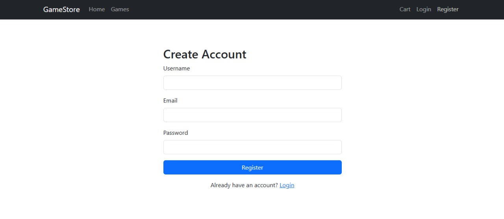
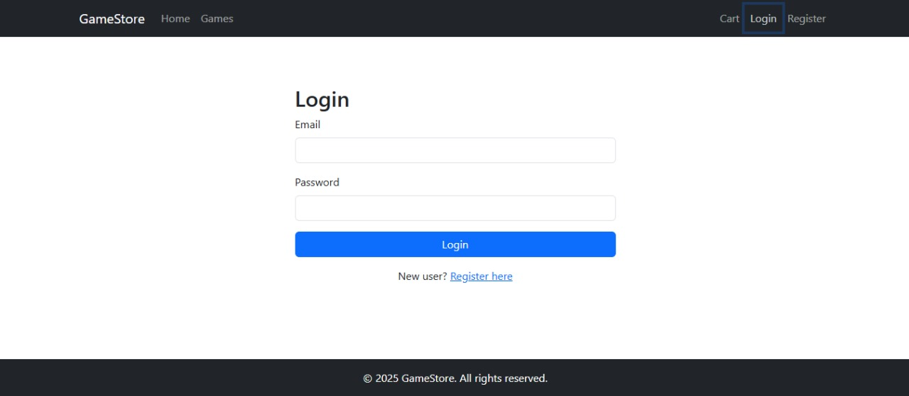
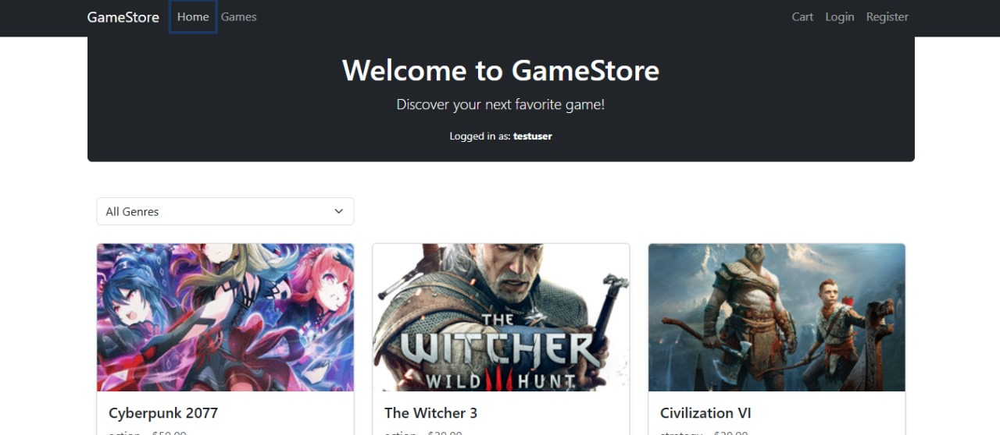
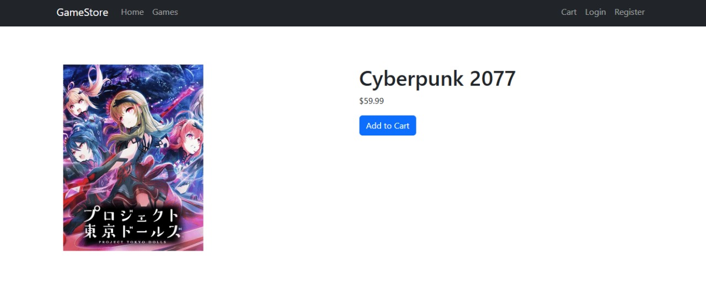
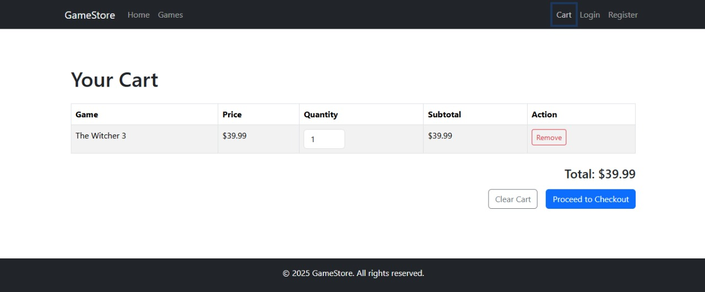
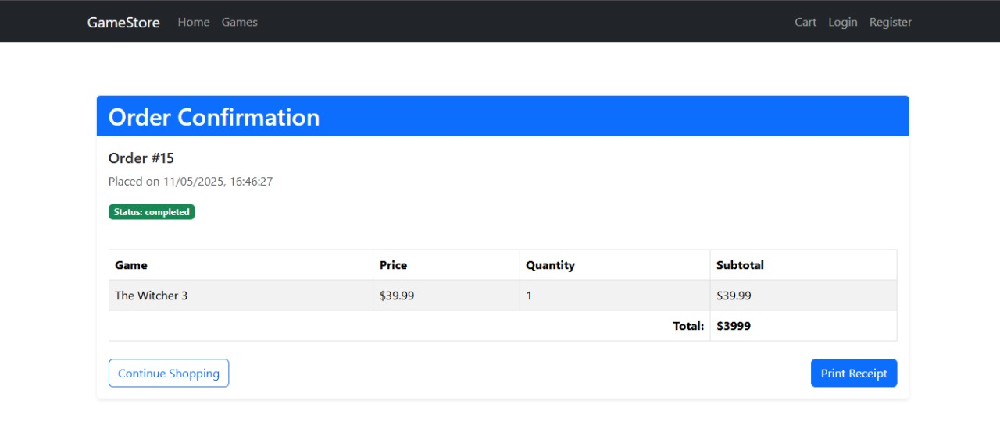

# 🛍️ React E-Commerce Platform

A full-featured **E-Commerce web app** built with **React**, **Node.js**, and **MySQL**.  
Modern UI, powerful backend, and a clean, scalable architecture — perfect for learning full-stack development.

[](https://reactjs.org/)
[](https://nodejs.org/)
[](https://www.mysql.com/)

---

## 📸 Screenshots

<div align="center">
  
   
  
  
  
  
</div>

---

## ⚙️ Features

- 🔍 Product search, filtering, and pagination
- 🛒 Add to cart, update quantity, remove items
- 💳 Checkout and order summary
- 🧑‍💼 Admin dashboard: manage products, users, and orders
- 🔐 User authentication (login, register)
- 🌐 API built with Express.js
- 🗃️ MySQL database integration
- 📦 Modular code structure with clean separation

---

## 🚀 Quick Start
```bash
# 1. Install dependencies
npm install

# 2. Configure MySQL credentials in backend/.env
DB_HOST=localhost
DB_USER=root
DB_PASSWORD=yourpassword (you are gonna use your own MySql password)
DB_NAME=ecommerce_db

# 3. Run both frontend and backend
npm run dev
